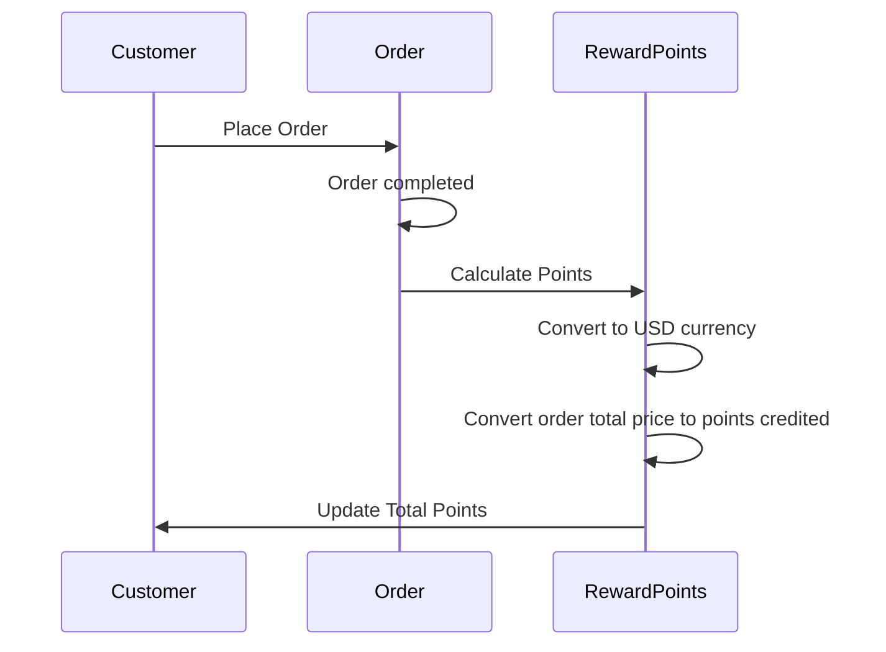

# Software Engineer Practical Test
## Question 01:
 In a user database table, we store User_ID, User_Name, User_Email. Due to an
application bug, the application does not convert email addresses to lowercase when
stored into the user table. Write a query to retrieve the User_ID of the user whose email
address contains some upper case characters (E.g. Username@example.com,
my_Username@example.com ).
```python 
SELECT User_ID
FROM User_Table
WHERE BINARY User_Email <> LOWER(User_Email);
```
### In this query:
- User_Table is the name of your user database table.
- User_ID, User_Name, and User_Email are the columns in the table.
- LOWER(User_Email) converts the User_Email to lowercase for comparison.

## Question 02:
In the G2G marketplace, sellers can create multiple offer listings under the same
category. For example, on this category listing page: Coc1 Account for Sale, you might
notice that the first few pages are dominated by offers from the same seller.
To ensure fair visibility for all sellers, G2G wants to implement a round-robin sequence
for displaying offer listings. This means each seller’s offers should be evenly distributed
throughout the listing pages, rather than being grouped together.
## Implement:
**1. Explain how you would design and implement this system to support the round-robin display of offers.**

**Database Partitioning by Seller**: Assign each listing a priority or order number to help distribute listings from different sellers more evenly.  

**Sorting and Filtering Support**: Use composite indices and a flexible query structure to allow listings to be retrieved efficiently based on different sorting criteria (e.g., by price, rating).

**Precomputed Round-Robin Sequence**: Use a precomputed sequence or row-based offset approach to determine the "next" listing for each seller. This ensures minimal computation during data retrieval.

 **2. Provide a high-level architecture of your solution.**
 
 - **Frontend UI**:
 
		- A dynamic interface for listing pages, allowing users to filter and sort listings.
		- Pagination controls to navigate through listings in a round-robin distribution.
 
  - **Backend Service**:  
  
		- API Endpoint: To retrieve listings based on user filters and pagination requirements.
		- Round-Robin Query Processor: Service that manages the round-robin selection and ensures balanced listing distribution for each seller.
  
   
**3. Include a sample database schema.**
```python 
      	CREATE TABLE Sellers (
           seller_id INT PRIMARY KEY,
           name VARCHAR(255),
           rating DECIMAL(3, 2)
        );
	
	CREATE TABLE Offers (
	    offer_id INT PRIMARY KEY,
	    seller_id INT,
	    category_id INT,
	    price DECIMAL(10, 2),
	    created_at TIMESTAMP,
	    status ENUM('active', 'inactive'),
	    FOREIGN KEY (seller_id) REFERENCES Sellers(seller_id)
	);

	CREATE TABLE Categories (
	    category_id INT PRIMARY KEY,
	    name VARCHAR(255)
	);
```

**4. Provide sample queries and code snippets that demonstrate how to achieve the round-robin display.**
```python
	import mysql.connector

	def get_round_robin_offers(category_id, page, page_size, lowest_price=None, highest_price=None):
	    # Calculate the offset for pagination
	    offset = (page - 1) * page_size
	    
	    # Connect to the MySQL database
	    connection = mysql.connector.connect(
	        host="localhost",
	        user="username",
	        password="password",
	        database="database"
	    )
	    cursor = connection.cursor(dictionary=True)

	    # Query to retrieve offers in round-robin order
	    query = """
	    WITH OrderedOffers AS (
	        SELECT 
	            offer_id,
	            seller_id,
	            price,
	            ROW_NUMBER() OVER(PARTITION BY seller_id ORDER BY created_at) AS seller_row
	        FROM Offers
	        WHERE category_id = %s 
	            AND status = 'active'
	            AND (%s IS NULL OR price >= %s)
	            AND (%s IS NULL OR price <= %s)
	    )
	    SELECT * FROM OrderedOffers
	    ORDER BY seller_row
	    LIMIT %s OFFSET %s;
	    """
	    # Execute the query
	    cursor.execute(query, (category_id, lowest_price, lowest_price, highest_price, highest_price, page_size, offset))
	    offers = cursor.fetchall()

	    # Close the connection
	    cursor.close()
	    connection.close()

	    return offers

	# Example usage of the function
	category_id = 1           # The category ID to filter offers
	page = 1                  # Current page number
	page_size = 10            # Number of offers per page
	lowest_price = 100.00     # Minimum price filter; set to None if not needed
	highest_price = None      # Maximum price filter; set to None if not needed

	offers = get_round_robin_offers(category_id, page, page_size, lowest_price, highest_price)
	for offer in offers:
	    print(f"Offer ID: {offer['offer_id']}, Seller ID: {offer['seller_id']}, Price: {offer['price']}")
```
## Question 03
Given a list of strings, write a function to determine the minimum number of deletionsrequired for each string so that no two adjacent characters are the same.

## Implement
```python
def min_deletions(strings):
    deletions = []
    
    for s in strings:
        count = 0  # Initialize deletion count for the current string
        # Iterate through the string, comparing adjacent characters
        for i in range(1, len(s)):
            if s[i] == s[i - 1]:  # If the current character is the same as the previous one
                count += 1  # Increment the deletion count
        deletions.append(count)  # Add the count for this string to the result list
    
    return deletions

# Example usage
input_strings = ["AAAA", "BBBBB", "ABABABAB", "AAABBB"]
output = min_deletions(input_strings)
print(output)  # Output: [3, 4, 0, 4]
```

## Question 04
Your company is developing a reward system with the following requirements:
- Customers will be rewarded with reward points when a sales order is in Delivered status.
- For every USD 1 of sales amount, customers will receive 1 point. If the sales amount is not in USD, it should be converted to its equivalent amount in USD for the reward calculation.
- Reward points will be credited to the customer's account with an expiry date, which is 1 year from the date of credit.
-  Points can be used for new order payments, where every 1 point is equivalent to USD 0.01.
## Implement
- **Sequence Diagram**:


- **Database Schema Design**:
	```python
		CREATE TABLE Customers (
	    customer_id INT PRIMARY KEY AUTO_INCREMENT,
	    name VARCHAR(255) NOT NULL,
	    email VARCHAR(255) NOT NULL UNIQUE,
	    total_points DECIMAL(10, 2) DEFAULT 0.00
	);

	CREATE TABLE Orders (
	    order_id INT PRIMARY KEY AUTO_INCREMENT,
	    customer_id INT,
	    status ENUM('Pending', 'Delivered', 'Cancelled'),
	    sales_amount DECIMAL(10, 2),
	    currency VARCHAR(3),
	    order_date TIMESTAMP DEFAULT CURRENT_TIMESTAMP,
	    FOREIGN KEY (customer_id) REFERENCES Customers(customer_id)
	);

	CREATE TABLE RewardPoints (
	    point_id INT PRIMARY KEY AUTO_INCREMENT,
	    customer_id INT,
	    points DECIMAL(10, 2),
	    expiry_date DATE,
	    credited_at TIMESTAMP DEFAULT CURRENT_TIMESTAMP,
	    FOREIGN KEY (customer_id) REFERENCES Customers(customer_id)
	);

	```
- **Function Implementations**:
	```python
	import mysql.connector
	from datetime import datetime, timedelta

	# Function to calculate and credit reward points
	def credit_reward_points(customer_id, sales_amount, currency):
	    # Connect to the database
	    connection = mysql.connector.connect(
	        host="localhost",
	        user="username",
	        password="password",
	        database="database"
	    )
	    cursor = connection.cursor()

	    # Convert sales amount to USD if necessary
	    if currency != 'USD':
	        # Assume there's a function to get the conversion rate
	        sales_amount = convert_to_usd(sales_amount, currency)

	    points = sales_amount  # 1 USD = 1 point

	    # Credit points to the customer's account
	    expiry_date = datetime.now() + timedelta(days=365)  # Expiry date set to 1 year from now
	    cursor.execute("INSERT INTO RewardPoints (customer_id, points, expiry_date) VALUES (%s, %s, %s)",
	                   (customer_id, points, expiry_date))
	    
	    # Update total points for the customer
	    cursor.execute("UPDATE Customers SET total_points = total_points + %s WHERE customer_id = %s",
	                   (points, customer_id))
	    
	    connection.commit()  # Save changes
	    cursor.close()
	    connection.close()

	# Function to deduct reward points
	def deduct_reward_points(customer_id, points_to_deduct):
	    connection = mysql.connector.connect(
	        host="localhost",
	        user="username",
	        password="password",
	        database="database"
	    )
	    cursor = connection.cursor()

	    # Check the current total points
	    cursor.execute("SELECT total_points FROM Customers WHERE customer_id = %s", (customer_id,))
	    current_points = cursor.fetchone()[0]

	    if current_points >= points_to_deduct:
	        # Deduct points
	        cursor.execute("UPDATE Customers SET total_points = total_points - %s WHERE customer_id = %s",
	                       (points_to_deduct, customer_id))
	        connection.commit()  # Save changes
	    else:
	        print("Not enough points to deduct.")

	    cursor.close()
	    connection.close()

	# Function to convert currency to USD
	def convert_to_usd(amount, currency):
	    # Placeholder function for currency conversion
	    conversion_rate = 1.0  # Replace with actual conversion rate
	    return amount * conversion_rate
	```
**Explanation of the Functions:**

-   **`credit_reward_points`**: This function takes customer ID, sales amount, and currency as input. It converts the sales amount to USD if necessary, calculates the points earned, credits the points to the customer's account, and updates the total points in the `Customers` table.
    
-   **`deduct_reward_points`**: This function takes customer ID and the amount of points to deduct. It checks if the customer has enough points before deducting the required amount.
    
-   **`convert_to_usd`**: This is a placeholder function that simulates converting an amount from another currency to USD based on an exchange rate.

